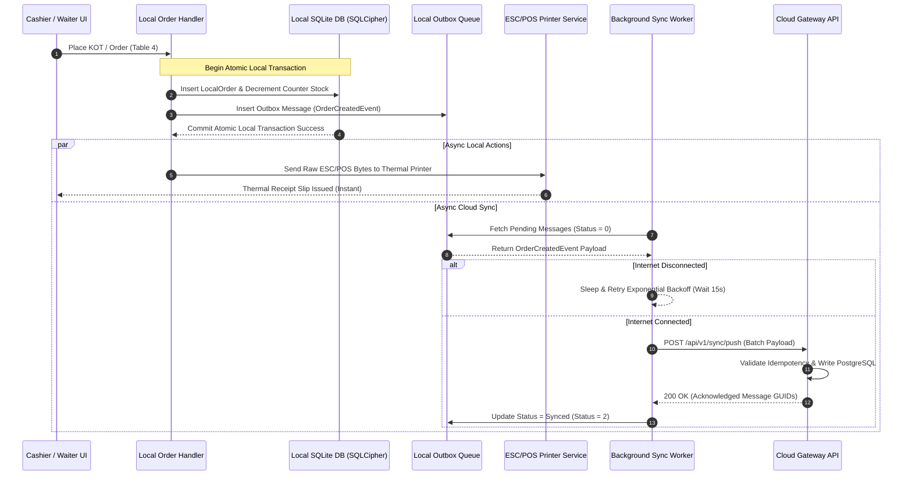
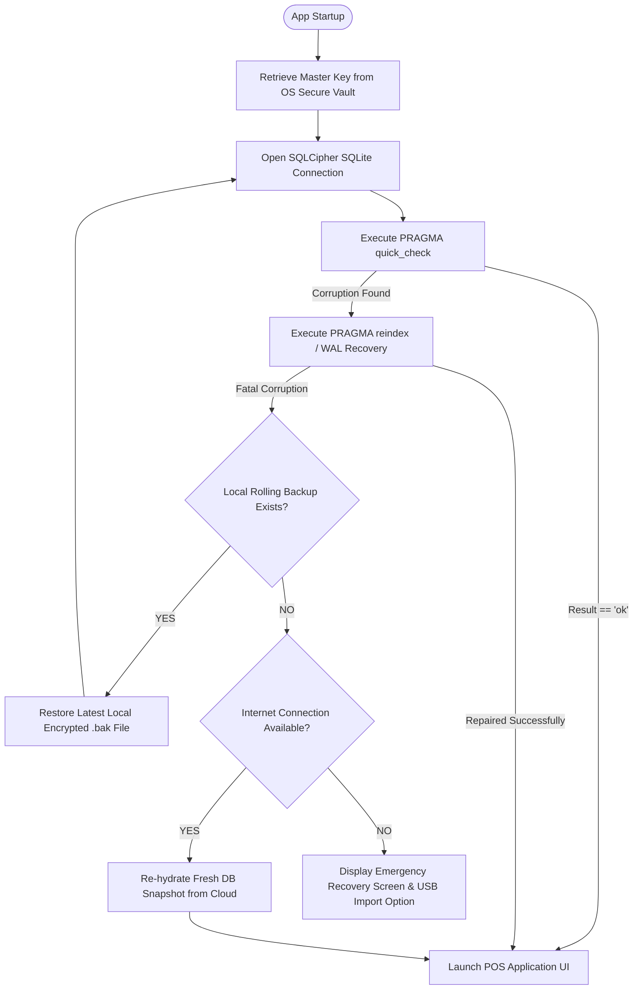

# Customer-Side Offline Architecture Specification

**Role:** Agent 7 — Offline Architecture Specialist
**System:** Yashdeep Hotel Management System (Modernized Cloud-Synchronized SaaS)
**Target Stack:** .NET 9, Blazor Hybrid (MAUI Desktop & Android POS), SQLite (SQLCipher), EF Core, Outbox/Inbox Synchronization Pattern, PostgreSQL 16 (Cloud Engine)

---

## 1. Architectural Principles & Offline Philosophy

The **Yashdeep Hotel Management System** operates in real-world Indian hospitality environments (Hotel Yashdeep, Bhenda, Maharashtra) where internet access may be intermittent, slow, or completely unavailable during storm outages or network carrier disruptions.

### Core Offline Principles

1. **Zero Operational Interruption (Offline-First Guarantee):**
   Core Point-of-Sale (POS) functions—table status updates, Kitchen Order Ticket (KOT) and Bar Order Ticket (BOT) generation, direct ESC/POS thermal printing, bill calculation, dynamic UPI QR generation, stock decrements, and daily closing audit (Day End)—**MUST** function continuously without relying on an active internet connection.

2. **Eventual Consistency via Outbox Synchronization:**
   Local business operations mutate local encrypted state within atomic SQLite transactions. Every state-altering action produces an immutable outbox event payload queued locally for asynchronous transmission to the PostgreSQL cloud server.

3. **Strict Data Minimization:**
   POS edge devices do not attempt to replicate the entire cloud PostgreSQL database. Only data required for current and short-term operational continuity (30 days of active transactions, localized active menu catalog, local section pricing, current stock levels, device configuration) exists locally.

4. **Cryptographic Protection at Rest:**
   All local operational data is encrypted at rest using SQLCipher (AES-256-CBC) with hardware-backed encryption keys.

---

## 2. Local Storage Architecture

### 2.1 Storage Engine & EF Core DbContext

The local customer-side storage engine relies on **SQLite 3** managed via **Entity Framework Core 9 (`Microsoft.EntityFrameworkCore.Sqlite`)** and encrypted using **SQLCipher (`SQLitePCLRaw.bundle_e_sqlcipher`)**.

```
┌─────────────────────────────────────────────────────────────────────────┐
│                     Blazor Hybrid POS Application                       │
├─────────────────────────────────────────────────────────────────────────┤
│  Yashdeep.LocalData.LocalDbContext (EF Core 9)                          │
├─────────────────────────────────────────────────────────────────────────┤
│  SQLitePCLRaw.bundle_e_sqlcipher (SQLCipher native C-library)           │
├─────────────────────────────────────────────────────────────────────────┤
│  Encrypted SQLite Database File (yashdeep_pos_local.db3)                │
└─────────────────────────────────────────────────────────────────────────┘
```

### 2.2 Platform Storage Paths

Local database files are stored in OS-designated application sandboxes with strict user access controls:

| Operating System | Target File Path | Access Permissions |
| :--- | :--- | :--- |
| **Windows Desktop (MAUI / WinUI 3)** | `%LOCALAPPDATA%\YashdeepPOS\Data\yashdeep_pos_local.db3` | Current Windows User / System Only |
| **Android POS Terminal (MAUI / Android)** | `/data/user/0/com.yashdeep.pos/files/yashdeep_pos_local.db3` | App Sandbox Direct Isolation (`MODE_PRIVATE`) |

### 2.3 SQLite Performance & Pragmas Configuration

To ensure maximum throughput, low-latency writes, and crash durability, every SQLite connection initializes with the following PRAGMA configuration:

```sql
-- Enforce Write-Ahead Logging (WAL) for concurrency (reads do not block writes)
PRAGMA journal_mode = WAL;

-- Balance durability and write latency (NORMAL is safe with WAL mode)
PRAGMA synchronous = NORMAL;

-- Enforce UTF-8 text encoding for bilingual English / Marathi Devanagari support
PRAGMA encoding = "UTF-8";

-- Enable Foreign Key constraint validation
PRAGMA foreign_keys = ON;

-- Set busy timeout to 5,000ms to handle concurrent thread accesses safely
PRAGMA busy_timeout = 5000;

-- Maintain a 64MB memory page cache for instant UI menu rendering
PRAGMA cache_size = -64000;

-- Store temporary tables and indices in RAM
PRAGMA temp_store = MEMORY;
```

---

## 3. Database Security & Encryption

### 3.1 SQLCipher AES-256-CBC Encryption

The local SQLite database is fully encrypted at the page level using **SQLCipher (AES-256-CBC)**. Unencrypted access to `yashdeep_pos_local.db3` via standard SQLite viewers is strictly impossible.

```csharp
public class LocalDbContextFactory : IDesignTimeDbContextFactory<LocalDbContext>
{
    public LocalDbContext CreateDbContext(string[] args)
    {
        var optionsBuilder = new DbContextOptionsBuilder<LocalDbContext>();
        var dbKey = HardwareSecurityManager.GetOrCreateDatabaseKey();

        var connectionString = new SqliteConnectionStringBuilder
        {
            DataSource = GetLocalDatabasePath(),
            Mode = SqliteOpenMode.ReadWriteCreate,
            Password = dbKey // SQLCipher passphrase
        }.ToString();

        optionsBuilder.UseSqlite(connectionString);
        return new LocalDbContext(optionsBuilder.Options);
    }
}
```

### 3.2 Cryptographic Key Derivation & Management

1. **Key Generation:** On initial device provision, the application generates a cryptographically random 256-bit key using `RandomNumberGenerator.GetBytes(32)`.
2. **Key Derivation (KDF):** The raw key is expanded using **Argon2id** (or PBKDF2 with HMAC-SHA256, 256,000 iterations) with a unique per-device salt.
3. **OS Hardware Key Store Integration:**
   - **Windows:** Key is encrypted via **DPAPI (Data Protection API)** (`ProtectedData.Protect` bound to current machine and user context).
   - **Android:** Key is generated and stored inside the **Android KeyStore Provider** backed by Hardware Security Module (HSM / TEE / StrongBox).

```
┌────────────────────────────────────────────────────────────────────────┐
│                   Database Key Protection Architecture                 │
├────────────────────────────────────────────────────────────────────────┤
│  1. Hardware / OS Security Vault                                      │
│     ├── Windows: DPAPI (Current Machine + User Context)               │
│     └── Android: Hardware-backed Android KeyStore (TEE / StrongBox)    │
│                                │                                       │
│                         Decrypts (In-Memory Only)                      │
│                                ▼                                       │
│  2. 256-Bit Master Database Key (SQLCipher Key Material)                │
│                                │                                       │
│                         Unlocks at Startup                             │
│                                ▼                                       │
│  3. Encrypted Local SQLite Database (AES-256 Page Encryption)           │
└────────────────────────────────────────────────────────────────────────┘
```

---

## 4. Local Data Boundaries & Minimization Policy

### 4.1 Allowed Local Data Scope (30-Day Operational Boundary)

The local SQLite database contains **ONLY** the minimal operational footprint required to run the hotel and bar POS smoothly for 30 rolling days:

```
Local Storage Entities (yashdeep_pos_local.db3)
├── 1. Active Operations & Dining State
│   ├── LocalDiningTable (Table layout, section assignment, active order status)
│   ├── LocalOrder (Active open tables & orders created within last 30 days)
│   ├── LocalOrderItem (Individual items attached to active/recent orders)
│   ├── LocalKot (KOT & BOT slips generated locally)
│   └── LocalBill (Bills generated, payment breakdown, UPI payment states)
├── 2. Menu Catalog & Section Pricing (Read-Only Copy)
│   ├── LocalMenuItem (Item master, category, Marathi bilingual name, tax tags)
│   ├── LocalSectionRate (Differential rates per section: Family, AC, VIP, Garden)
│   └── LocalLiquorBrand (Liquor items, peg volume definitions: 30ml, 60ml, 90ml, 180ml)
├── 3. Stock & Inventory Counters (Edge Operational Subset)
│   ├── LocalCounterStock (Sealed bottle counter stock counts)
│   └── LocalLooseStock (Open bottle loose millilitre volumes)
├── 4. Offline Sync Infrastructure
│   ├── LocalOutboxMessage (Queued state mutations to be synced to cloud)
│   └── LocalInboxMessage (Processed incoming cloud sync payloads for deduplication)
└── 5. Device Identity & Subscription State
    ├── LocalDeviceConfig (Device ID, Assigned Branch/Tenant, Local Hardware Printers)
    └── LocalEntitlementCache (Signed JWT containing offline license entitlements & grace period)
```

### 4.2 Data That Must NEVER Be Stored Locally

To guarantee tenant isolation, security compliance, compliance with privacy regulations, and storage efficiency, the following data is **STRICTLY FORBIDDEN** on local POS storage:

1. **Central Master Customer Database & Credit Histories:** Historical cross-tenant or long-term multi-year customer ledgers.
2. **Historical Financial Analytics & Multi-Year Ledger Archives:** Full multi-year accounting journals, trial balances, and historic annual reports.
3. **Central Cloud System Users & Passwords:** Cloud super-admin credentials, system-wide admin user tables, or password hashes of non-local staff.
4. **Other Tenant Data:** Any record belonging to another `TenantId` or another branch location.
5. **Raw Credit Card / Payment Token Data:** Payment Card Industry (PCI) sensitive data (only payment reference IDs and local dynamic UPI string hashes are cached).
6. **Complete State Excise Multi-Year Master Registers:** Full historical state excise records spanning years (only the active month's operational daily log is calculated for local daily export).

### 4.3 Anti-Pattern Safeguards

- **NO Complete Cloud DB Replication:** The local SQLite schema is an **operational subset**, not a 1:1 clone of the cloud PostgreSQL schema.
- **NO Reproduction of Legacy Access Schema (`dinurss.mdb`):** Modern clean entity structures replace legacy unnormalized Access patterns (e.g., legacy `BILLFINAL` vs `BILLFINAL_Dayend` table duplication is replaced by unified normalized entities with temporal status indicators).

---

## 5. Local Repositories & CQRS Architecture

### 5.1 CQRS and Unit of Work Pattern in Blazor Hybrid

The local client uses **MediatR** for local CQRS command and query handling.

```
┌────────────────────────────────────────────────────────────────────────┐
│                        Blazor Hybrid UI Layer                          │
└────────────────────────────────────────────────────────────────────────┘
                    │                               ▲
             Commands / Queries              DTO Results
                    ▼                               │
┌────────────────────────────────────────────────────────────────────────┐
│             Local CQRS Handlers (MediatR In-Process)                   │
├────────────────────────────────────────────────────────────────────────┤
│  Queries: Fetch from Local L1 MemoryCache / ReadDbContext              │
│  Commands: Execute via Local UnitOfWork (WriteDbContext + Outbox)      │
└────────────────────────────────────────────────────────────────────────┘
                    │                               ▲
          Entities & Outbox Write           Read Entity Queries
                    ▼                               │
┌────────────────────────────────────────────────────────────────────────┐
│              Local Unit of Work / LocalDbContext (SQLite)              │
└────────────────────────────────────────────────────────────────────────┘
```

### 5.2 Read / Write Repository Split

```csharp
// Read Repository Interface (Query Side)
public interface ILocalReadRepository<TEntity> where TEntity : class
{
    IQueryable<TEntity> QueryAsNoTracking();
    Task<TEntity?> GetByIdAsync(Guid id, CancellationToken ct = default);
}

// Write Repository Interface (Command Side - Enforces Transaction & Outbox)
public interface ILocalWriteRepository<TEntity> where TEntity : AggregateRoot
{
    Task AddAsync(TEntity entity, CancellationToken ct = default);
    void Update(TEntity entity);
    void Remove(TEntity entity);
}

// Unit of Work wrapping local SQLite transaction and outbox generation
public interface ILocalUnitOfWork
{
    Task<int> SaveChangesAndOutboxAsync<TEvent>(TEvent domainEvent, CancellationToken ct = default)
        where TEvent : IDomainEvent;
}
```

---

## 6. Local Caching Framework

### 6.1 Multi-Tier Caching Architecture

To achieve sub-millisecond response times for POS touch interfaces, the application uses a two-tier local caching framework:

```
[ UI Touch Screen / Order Entry Grid ]
                │
                ▼
┌───────────────────────────────────────────┐
│  L1 In-Memory Cache (IMemoryCache)       │ ◄── Sub-millisecond lookup
│  - Active Menu Catalog & Bilingual Names  │     (RAM resident)
│  - Section Rate Overrides                 │
│  - Active Table Status Map                │
└───────────────────────────────────────────┘
                │
         Cache Miss / Refetch
                ▼
┌───────────────────────────────────────────┐
│  L2 Encrypted Local Storage (SQLite)      │ ◄── Persistent offline store
│  - LocalDbContext Indexed Tables          │     (SQLCipher on disk)
└───────────────────────────────────────────┘
```

### 6.2 Cache TTL and Eviction Policies

| Cache Domain | Storage Tier | Expiration / TTL | Eviction / Invalidation Trigger |
| :--- | :--- | :--- | :--- |
| **Menu Catalog & Prices** | L1 RAM | 4 Hours (Absolute) | Manual Sync trigger, Outbound Menu Sync, Manager Price Edit |
| **Table Status Map** | L1 RAM | Sliding 30 Mins | Table Order state change, KOT Save, Settlement, Day End |
| **Active Stock Levels** | L1 RAM | Immediate / No L1 TTL | Invalidated instantly on every bottle open / peg sale |
| **Entitlement Cache** | L1 RAM + L2 SQLite | 24 Hours | Application restart, Background Entitlement refresh |

---

## 7. Offline Business Operations Capability

The local architecture is completely self-contained to execute 100% of day-to-day hospitality operations without internet:

```
┌────────────────────────────────────────────────────────────────────────────────┐
│                       OFFLINE BUSINESS OPERATIONS ENGINE                       │
├────────────────────────────────────────────────────────────────────────────────┤
│  1. Table & Seating Management                                                 │
│     ├── Real-time visual table grid (Vacant, Occupied, KOT Active, Billed)      │
│     └── Table shift & table merge logic                                        │
├────────────────────────────────────────────────────────────────────────────────┤
│  2. Bilingual KOT / BOT Generation                                             │
│     ├── Devanagari (Marathi) translation lookup (item.MarathiName)             │
│     └── Direct ESC/POS thermal printing to LAN/USB kitchen printers            │
├────────────────────────────────────────────────────────────────────────────────┤
│  3. Financial Calculation & Billing Engine                                     │
│     ├── Section differential pricing (Family, AC, Garden, VIP rates)           │
│     ├── Split Tax calculations (Food CGST 2.5% + SGST 2.5%, Bar Excise VAT)     │
│     └── Bill print layout generation via QuestPDF                              │
├────────────────────────────────────────────────────────────────────────────────┤
│  4. Dynamic Offline UPI QR Code Generation                                     │
│     └── Generates compliant string: upi://pay?pa=dinu...&am=TOTAL&tn=BILL_1234 │
├────────────────────────────────────────────────────────────────────────────────┤
│  5. Multi-Tier Liquor & Counter Stock Decrement                                │
│     ├── Automatic loose peg volume calculation (30ml, 60ml, 90ml, 180ml)       │
│     └── Automatic sealed bottle opening trigger when loose volume hits 0ml     │
├────────────────────────────────────────────────────────────────────────────────┤
│  6. Local Day-End Settlement & Rollover                                        │
│     ├── Validates all tables are settled                                       │
│     ├── Calculates daily sales summary                                         │
│     └── Resets daily counters (BILLNUMBERDAY = 1, KOTNO = 1)                   │
└────────────────────────────────────────────────────────────────────────────────┘
```

---

## 8. Outbox & Inbox Synchronization Engine

### 8.1 Outbox Schema & Pattern Implementation

Every operational write in the local database creates an immutable `LocalOutboxMessage` record within the **same SQLite local transaction**.

```sql
CREATE TABLE LocalOutboxMessage (
    Id TEXT PRIMARY KEY,                       -- Unique Message GUID
    IdempotencyKey TEXT NOT NULL,             -- Unique Token (DeviceGUID + Timestamp + Seq)
    TenantId TEXT NOT NULL,                    -- Organization Tenant ID
    DeviceId TEXT NOT NULL,                    -- Originating POS Device GUID
    EventType TEXT NOT NULL,                   -- e.g., "OrderCreated", "BillSettled"
    PayloadJson TEXT NOT NULL,                 -- Complete serialized JSON payload
    CreatedAt TEXT NOT NULL,                   -- ISO-8601 UTC timestamp
    ProcessedAt TEXT NULL,                     -- UTC timestamp when cloud acknowledged
    RetryCount INTEGER NOT NULL DEFAULT 0,    -- Number of failed sync attempts
    LastError TEXT NULL,                       -- Exception message on failure
    Status INTEGER NOT NULL DEFAULT 0          -- 0: Pending, 1: Syncing, 2: Synced, 3: Failed
);

CREATE INDEX IX_LocalOutboxMessage_Status_CreatedAt
ON LocalOutboxMessage (Status, CreatedAt);
```

### 8.2 Outbox Sync Processing Worker Flow

```
   [ Local SQLite Outbox ]
             │
             ├── Select Pending Messages (Status = 0, Limit = 50, OrderBy CreatedAt)
             │
             ▼
   [ Background Sync Worker ] ◄── Triggered every 15s OR on WebSockets re-connect
             │
             ├── Form Batch POST Payload -> /api/v1/sync/push
             │
             ▼
   [ Cloud PostgreSQL Gateway ]
             ├── Validate Idempotency Keys (Ignore already processed)
             ├── Apply mutations in PostgreSQL Transaction
             └── Return Acknowledgement (List of Processed Message IDs + Server ServerVersion)
             │
             ▼
   [ Background Sync Worker ]
             ├── Mark local Outbox messages as Synced (Status = 2, ProcessedAt = Now)
             └── Trigger Local Outbox Purge if age > 7 days
```

### 8.3 Inbox Pattern Schema & Cloud Delta Synchronization

To safely accept inbound updates from the cloud (e.g., price changes updated on cloud admin, menu modifications) without duplicates or overwrites, the local POS uses an `LocalInboxMessage` ledger.

```sql
CREATE TABLE LocalInboxMessage (
    Id TEXT PRIMARY KEY,                       -- Server Message GUID
    ServerVersion INTEGER NOT NULL,            -- Monotonic Sequence Number
    EventType TEXT NOT NULL,                   -- e.g., "MenuUpdated", "StockAdjusted"
    PayloadJson TEXT NOT NULL,                 -- Incoming JSON Payload
    ReceivedAt TEXT NOT NULL,                  -- ISO-8601 UTC timestamp
    ProcessedAt TEXT NULL,                     -- Processing timestamp
    Status INTEGER NOT NULL DEFAULT 0          -- 0: Pending, 1: Processed, 2: Failed
);
```

### 8.4 Conflict Resolution Rules

| Scenario | Conflict Resolver Strategy | Rule Description |
| :--- | :--- | :--- |
| **Order / Bill Creation** | **Client Wins (Append-Only)** | Unique local client-generated UUIDs guarantee no primary key collisions on server. |
| **Menu / Price Change** | **Server Authoritative** | Server menu price edits overwrite local cache once synced inbound. |
| **Stock Adjustments** | **Delta Math Accumulation** | Stock decrements are applied as relative deltas (e.g. `-60ml`), not absolute state replacements. |
| **Table Status Lock** | **Last Write Wins (Timestamp)** | Latest timestamp determines active table state if multiple local nodes update offline. |

---

## 9. Local Transaction Boundaries & ACID Guarantees

### 9.1 Atomic Transaction Wrapping

Every business operation strictly couples domain mutation and Outbox queuing inside a single local SQLite ACID transaction:

```csharp
public async Task<bool> SettleBillAsync(Guid billId, PaymentDetails payment, CancellationToken ct)
{
    using var transaction = await _dbContext.Database.BeginTransactionAsync(ct);
    try
    {
        // 1. Mutate Local Business Entity
        var bill = await _dbContext.Bills.FindAsync(new object[] { billId }, ct);
        bill.MarkAsPaid(payment);

        var table = await _dbContext.DiningTables.FindAsync(new object[] { bill.TableId }, ct);
        table.ReleaseTable();

        // 2. Generate Outbox Event Payload
        var eventId = Guid.NewGuid();
        var outboxMessage = new LocalOutboxMessage
        {
            Id = eventId,
            IdempotencyKey = $"{_deviceConfig.DeviceId}_{eventId}_{DateTime.UtcNow.Ticks}",
            TenantId = _deviceConfig.TenantId,
            DeviceId = _deviceConfig.DeviceId,
            EventType = nameof(BillSettledEvent),
            PayloadJson = JsonSerializer.Serialize(new BillSettledEvent(bill, payment)),
            CreatedAt = DateTime.UtcNow,
            Status = OutboxStatus.Pending
        };

        await _dbContext.OutboxMessages.AddAsync(outboxMessage, ct);

        // 3. Commit Atomic Local SQLite Transaction
        await _dbContext.SaveChangesAsync(ct);
        await transaction.CommitAsync(ct);

        // 4. Trigger UI ESC/POS Thermal Printing (Outside Transaction Scope)
        _thermalPrinterService.PrintReceipt(bill);

        return true;
    }
    catch (Exception ex)
    {
        await transaction.RollbackAsync(ct);
        _logger.LogError(ex, "Failed to settle bill {BillId} locally", billId);
        throw;
    }
}
```

### 9.2 Thread Safety & Single-Writer Rule

SQLite supports multiple concurrent readers in WAL mode, but only **one writer at a time**. To prevent `SQLiteBusyException` under heavy POS usage:
1. SQLite connection string specifies `PRAGMA busy_timeout = 5000;`.
2. All write operations across Blazor UI components route through a singleton `SemaphoreSlim(1, 1)` write lock manager in `LocalDbContext`.

---

## 10. Device Identity, Licensing & Offline Grace Policy

### 10.1 Hardware-Bound Device Identity

During initial deployment onboarding, every POS device registers with the cloud server and stores an encrypted hardware profile:

```json
{
  "DeviceId": "POS-YASHDEEP-BAR-01-7F89A02B",
  "TenantId": "TENANT-YASHDEEP-BHENDA",
  "HardwareFingerprint": "CPU-88192-MB-99201-MAC-001A2B3C4D5E",
  "DeviceRole": "PrimaryBarCounterPOS",
  "AssignedPrinterAddress": "192.168.1.200"
}
```

### 10.2 Offline Entitlement Cache & Subscription Grace Policy

To prevent business disruption during cloud outages while protecting subscription licensing, the POS maintains a signed **Offline Entitlement JWT**:

```
┌────────────────────────────────────────────────────────────────────────┐
│                     OFFLINE SUBSCRIPTION GRACE ENGINE                  │
├────────────────────────────────────────────────────────────────────────┤
│  Entitlement Payload (Signed RS256 JWT from Cloud Authority)          │
│  ├── TenantId: "TENANT-YASHDEEP-BHENDA"                                │
│  ├── LicenseTier: "EnterpriseBarAndRestaurant"                         │
│  ├── ExpirationDate: "2026-12-31T23:59:59Z"                           │
│  ├── OfflineGraceDays: 14 Days                                         │
│  └── LastCloudHandshake: "2026-03-30T08:00:00Z"                        │
└────────────────────────────────────────────────────────────────────────┘
```

### 10.3 Subscription Grace Period State Machine

```
               Cloud Ping Success
  ┌──────────────────────────────────────────┐
  │                                          │
  ▼                                          │
┌───────────────────────────┐    Internet Lost > 24 Hours    ┌───────────────────────────┐
│   STATE 1: ONLINE / VALID │ ─────────────────────────────► │ STATE 2: OFFLINE GRACE    │
│   Full POS functionality  │                                │ (Days 1 - 10)             │
└───────────────────────────┘                                │ Full POS functionality    │
                                                             │ Non-intrusive warning banner│
                                                             └───────────────────────────┘
                                                                           │
                                                                 Internet Lost > 10 Days
                                                                           │
                                                                           ▼
┌───────────────────────────┐    Internet Lost > 14 Days     ┌───────────────────────────┐
│ STATE 4: READ-ONLY LOCK   │ ◄───────────────────────────── │ STATE 3: CRITICAL GRACE   │
│ POS Writes Restricted     │                                │ (Days 11 - 14)            │
│ Reports & View Only       │                                │ Prominent Alert Modal     │
└───────────────────────────┘                                │ Offline Operations Active │
                                                             └───────────────────────────┘
```

1. **Days 1 – 10 (Standard Grace):** Full uninterrupted POS operations. A subtle indicator displays "Offline Mode (Grace Period Day X/14)".
2. **Days 11 – 14 (Critical Warning Grace):** Full POS operational capabilities remain active. Prominent warning banner alerts management to connect device to internet.
3. **Day 15+ (Exhausted Grace / Read-Only Mode):** New POS orders and bill creations are blocked. Historical reports, viewing existing bills, and manual data export remain active until a cloud handshake re-validates entitlement signatures.

---

## 11. Local Configuration Management

### 11.1 Local Configuration Hierarchy (`appsettings.Local.json`)

Configuration settings are loaded from `appsettings.Local.json` stored locally on the terminal:

```json
{
  "LocalEnvironment": {
    "NodeRole": "PrimaryPOS",
    "BranchCode": "BHENDA-01",
    "DatabaseName": "yashdeep_pos_local.db3",
    "SyncIntervalSeconds": 15,
    "MaxOutboxBatchSize": 50
  },
  "HardwarePrinters": {
    "KitchenPrinter": {
      "ConnectionType": "NetworkLAN",
      "IpAddress": "192.168.1.150",
      "Port": 9100,
      "PaperWidthMm": 80,
      "PrintMarathiBilingual": true
    },
    "BarPrinter": {
      "ConnectionType": "USB",
      "PortName": "COM3",
      "BaudRate": 9600,
      "PaperWidthMm": 80
    }
  }
}
```

---

## 12. Data Retention & Maintenance

### 12.1 Operational Data Retention Policy (30 Days)

To keep the local encrypted SQLite database lightweight, high-performing, and bounded within ~100MB – 300MB:

1. **Active Window:** Transactions (orders, bills, KOTs) generated within the last **30 days** remain fully queryable locally.
2. **Archived / Synced Window (> 30 Days):** Fully synced outbox records, processed inbox records, and orders older than 30 days are purged from local SQLite by a background maintenance worker.

### 12.2 Automated Pruning & Vacuum Worker

Every night during the local Day-End procedure, the system executes maintenance tasks:

```sql
-- 1. Purge successfully synced outbox messages older than 7 days
DELETE FROM LocalOutboxMessage
WHERE Status = 2 AND ProcessedAt < datetime('now', '-7 days');

-- 2. Purge processed inbox messages older than 7 days
DELETE FROM LocalInboxMessage
WHERE Status = 1 AND ProcessedAt < datetime('now', '-7 days');

-- 3. Purge historical settled orders older than 30 days
DELETE FROM LocalOrder
WHERE IsSettled = 1 AND ClosedAt < datetime('now', '-30 days');

-- 4. Reclaim fragmented space and optimize B-Tree indices
PRAGMA optimize;
VACUUM;
```

---

## 13. Application Upgrade & Schema Migration Behavior

### 13.1 EF Core Migrations on SQLite

When updating the Blazor Hybrid application version, schema migrations are safely applied to the local encrypted SQLite database at app initialization:

```csharp
public async Task UpgradeDatabaseSchemaAsync(LocalDbContext dbContext)
{
    // 1. Create temporary pre-upgrade backup
    string dbPath = GetLocalDatabasePath();
    string backupPath = $"{dbPath}.migration_backup";
    File.Copy(dbPath, backupPath, overwrite: true);

    try
    {
        // 2. Execute Pending EF Core Migrations
        var pendingMigrations = await dbContext.Database.GetPendingMigrationsAsync();
        if (pendingMigrations.Any())
        {
            await dbContext.Database.MigrateAsync();
        }

        // 3. Remove temporary backup on success
        if (File.Exists(backupPath)) File.Delete(backupPath);
    }
    catch (Exception ex)
    {
        // 4. Restore backup on failure to prevent bricked offline terminal
        if (File.Exists(backupPath))
        {
            File.Copy(backupPath, dbPath, overwrite: true);
        }
        throw new InvalidOperationException("Local DB Migration Failed. Restored previous version.", ex);
    }
}
```

### 13.2 Outbox Payload Schema Versioning

All outbox message payloads include a `PayloadVersion` property (e.g., `v1`, `v2`). The cloud gateway maintains backward-compatible DTO deserializers for older client payload versions.

---

## 14. Reliability, Crash Recovery & Corruption Handling

### 14.1 Crash Recovery via Write-Ahead Logging (WAL)

SQLite WAL mode guarantees ACID resilience against sudden power loss, system crashes, or battery depletion:
- Uncommitted transactions inside the WAL file (`.db3-wal`) are automatically rolled back upon next app launch.
- Committed transactions inside the WAL file are automatically checkpointed into the main database file.

### 14.2 Corruption Detection & Recovery Protocol

```
                   [ Application Launch ]
                             │
                             ▼
             [ Execute Integrity Verification ]
             PRAGMA quick_check; / PRAGMA integrity_check;
                             │
            ┌────────────────┴────────────────┐
            ▼                                 ▼
       [ OK / PASS ]                  [ CORRUPTION DETECTED ]
            │                                 │
   Normal Startup Continues                   ▼
                                 [ Step 1: Attempt WAL Repair ]
                                 PRAGMA reindex;
                                             │
                                    ┌────────┴────────┐
                                    ▼                 ▼
                               [ REPAIRED ]      [ FATAL CORRUPT ]
                                    │                 │
                           Normal Startup             ▼
                                             [ Step 2: Restore Rolling ]
                                             [ Local Encrypted Backup  ]
                                                      │
                                             ┌────────┴────────┐
                                             ▼                 ▼
                                        [ SUCCESS ]       [ FAILED ]
                                             │                 │
                                    Normal Startup             ▼
                                                      [ Step 3: Re-hydrate  ]
                                                      [ Fresh DB from Cloud ]
```

### 14.3 Disaster Recovery: Cloud Re-Hydration Strategy

If local database files suffer physical disk corruption and no local backups exist:
1. The app initializes a fresh, empty encrypted SQLite database file.
2. Device performs TLS authentication with Cloud Server using its hardware device key pair.
3. App invokes `POST /api/v1/sync/rehydrate`.
4. Cloud server streams down the active 30-day operational snapshot (active menu, table layout, section rates, stock balances, active unsettled orders).
5. Terminal becomes fully operational within minutes.

---

## 15. Backup and Recovery of Local Operational Data

### 15.1 Automated Rolling Encrypted Backups

The system automatically creates compressed, encrypted rolling backups of `yashdeep_pos_local.db3`:

- **Backup Schedule:** Triggered automatically prior to executing the local Day-End settlement procedure.
- **Retention Count:** Maintains the last **7 daily backups** (`backup_day_1.bak` ... `backup_day_7.bak`).
- **Encryption:** Backup files are encrypted using AES-256 with the device hardware master key.

### 15.2 Manual USB Export / Restore Tool

For emergency site recovery without internet:
- Managers can trigger "Export Encrypted Backup to USB" from the Admin Settings panel.
- The exported `.ybak` file can be imported onto a replacement POS hardware terminal.

---

## 16. Offline Architecture Lifecycle & Sequence Diagrams

### 16.1 Master Offline Architecture Lifecycle Diagram

```mermaid
flowchart TD
    subgraph ClientDevice ["Edge POS Device (Blazor Hybrid / SQLite)"]
        UI["Blazor Hybrid Touch UI"]
        Repo["Local Repository & CQRS"]
        LocalDB[(Encrypted SQLite DB SQLCipher)]
        OutboxQ["Outbox Queue"]
        SyncEngine["Background Sync Worker"]
        PrintEngine["ESC/POS Thermal Printing"]
    end

    subgraph Hardware ["Local Hardware Peripherals"]
        KPrinter["Kitchen Thermal Printer (LAN/USB)"]
        BPrinter["Bar Thermal Printer (USB)"]
    end

    subgraph CloudServer ["Cloud Architecture (PostgreSQL)"]
        CloudAPI["ASP.NET Core Web API Gateway"]
        CloudDB[(Cloud PostgreSQL 16 DB)]
    end

    %% User Workflow
    UI -->|1. Create KOT / Bill| Repo
    Repo -->|2. Atomic ACID Write| LocalDB
    LocalDB -.->|3. Includes Event Payload| OutboxQ
    Repo -->|4. Trigger Print| PrintEngine
    PrintEngine -->|Direct Thermal Print| KPrinter
    PrintEngine -->|Direct Thermal Print| BPrinter

    %% Sync Workflow
    OutboxQ -->|5. Read Pending Events| SyncEngine
    SyncEngine -->|6. Check Connectivity| NetCheck{Internet Available?}

    NetCheck -- YES -->|7. POST Batch Payload| CloudAPI
    CloudAPI -->|8. Apply Mutation| CloudDB
    CloudAPI -->|9. Ack Message IDs| SyncEngine
    SyncEngine -->|10. Mark Synced| LocalDB

    NetCheck -- NO -->|Retry with Exponential Backoff| SyncEngine
```

### 16.2 Offline Transaction & Outbox Flow Diagram



### 16.3 Database Integrity & Corruption Recovery Flow



---

## 17. Architecture Verification Checklist

| Architectural Requirement | Implementation Status | Design Mechanism |
| :--- | :--- | :--- |
| **Local Storage** | Defined | SQLite 3 via EF Core 9 with WAL mode and custom page size. |
| **Encrypted Database** | Defined | SQLCipher AES-256-CBC page encryption + OS Secure Vault (DPAPI / KeyStore). |
| **Local Repositories** | Defined | Read/Write Repository split, CQRS via MediatR, Unit of Work pattern. |
| **Local Cache** | Defined | Tier 1 In-Memory (`IMemoryCache`) + Tier 2 Local Encrypted Storage. |
| **Offline Operations** | Defined | 100% self-contained KOT/BOT, differential section pricing, ESC/POS printing, UPI QR, peg decrements, Day End. |
| **Outbox Pattern** | Defined | Single local ACID transaction write, idempotency token, backoff queue worker. |
| **Inbox Pattern** | Defined | Cloud inbound delta processing, deduplication, server-version tracking. |
| **Transaction Boundaries**| Defined | Atomic SQLite transactions wrapping business domain change + outbox message. |
| **Device Identity** | Defined | Cryptographic hardware fingerprinting, device GUID, signed RS256 token. |
| **Entitlement & Grace** | Defined | Offline Entitlement JWT cache, 14-day subscription grace period state machine. |
| **Local Configuration** | Defined | `appsettings.Local.json` + encrypted hardware printer parameters. |
| **Data Retention** | Defined | 30-day operational rolling retention, automated night-end vacuum/purge. |
| **Data Minimization** | Defined | Strict whitelist of allowed local entities vs forbidden cloud-only data. |
| **Upgrade Behavior** | Defined | Auto EF Core migrations with safety pre-upgrade backup restore fallback. |
| **Crash & Corruption** | Defined | WAL crash resilience, `PRAGMA quick_check`, rolling backup restore, cloud re-hydration. |
| **Backup & Recovery** | Defined | Pre-Day-End encrypted daily rolling backups + manual USB export/import. |
| **No Legacy Access** | Confirmed | Clean modern normalized SQLite DDL replacing legacy `dinurss.mdb`. |
| **No Full Cloud Clone** | Confirmed | Operational subset bounded to single tenant's active 30-day edge data. |
| **Diagrams Included** | Confirmed | Mermaid lifecycle, sequence, and recovery flow diagrams included. |
