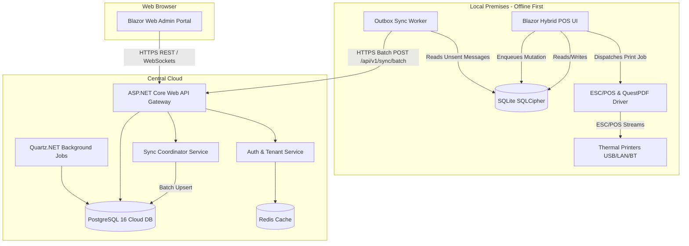
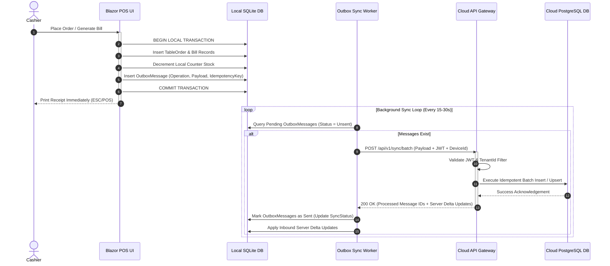
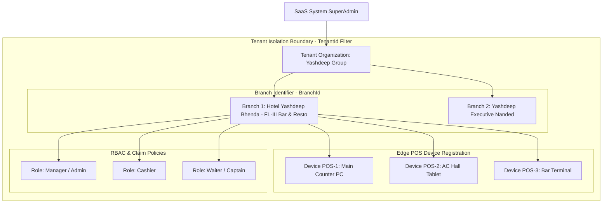
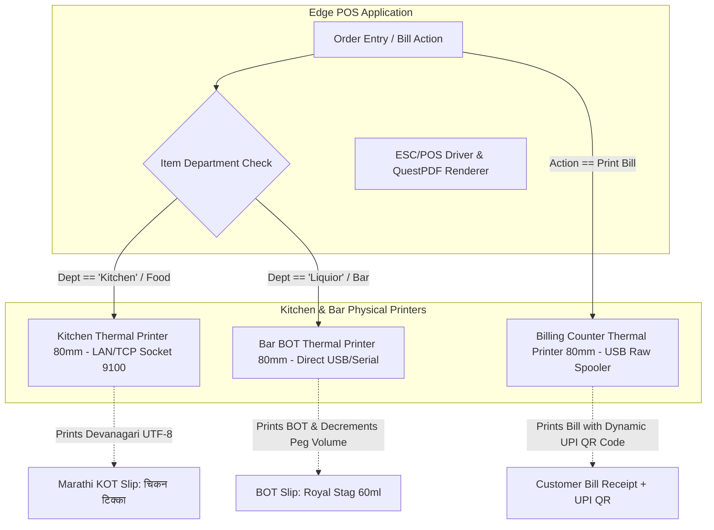

# Authoritative SaaS System Architecture & Technical Blueprint

> **Role & Authority**: Agent 1 — Principal System Architect
> **Status**: Active & Authoritative Master Blueprint
> **Target Platform**: .NET 9 Blazor Hybrid / MAUI Edge POS + Cloud ASP.NET Core Web API + PostgreSQL 16 + SQLite SQLCipher

---

## 1. Executive Summary & Architecture Philosophy

This document defines the **authoritative system architecture** for modernizing the legacy Yashdeep Hotel Management System (RSS / Real Soft VB.NET WinForms + Access Jet 4.0) into a enterprise-grade, offline-first, multi-tenant cloud-synchronized SaaS platform.

### Core Architecture Philosophy
1. **Offline-First Resilience**: Edge POS terminals (Windows/Android) must operate 100% autonomously without active cloud connectivity. Billing, KOT generation, stock updates, and thermal printing never block on network latency or outages.
2. **Server-Authoritative Multi-Tenancy**: Tenant isolation, global subscription rules, identity management, and consolidated reporting are enforced strictly on the cloud server.
3. **Event-Driven Outbox Synchronization**: Data mutations at the edge are enqueued in a local transactionally-consistent Outbox Queue and asynchronously synchronized with the Cloud Central API via batching and idempotency keys.
4. **Clean Architecture & CQRS**: System components follow strict separation of concerns (`Domain` -> `Application` -> `Infrastructure` -> `Api`/`Client`), utilizing MediatR CQRS patterns, FluentValidation, and EF Core.

---

## 2. Complete System Boundary & Topology

### 2.1 System Boundary Definition

```
┌───────────────────────────────────────────────────────────────────────────────────────────┐
│                                SYSTEM BOUNDARY                                            │
│                                                                                           │
│   ┌────────────────────────────────┐            ┌────────────────────────────────────┐   │
│   │    EDGE / LOCAL POS NETWORK    │            │         CLOUD SAAS CONTROL         │   │
│   │  (Restaurant & Bar Premises)   │            │           (Multi-Tenant)           │   │
│   │                                │            │                                    │   │
│   │  - Blazor Hybrid / MAUI App    │            │  - Web Admin Portal (Blazor Web)   │   │
│   │  - SQLite (SQLCipher Encrypted)│   HTTPS    │  - ASP.NET Core 9 Gateway API      │   │
│   │  - Local Outbox Queue          │  REST / WS │  - Auth & Tenant Management      │   │
│   │  - Direct ESC/POS Hardware     │ <========> │  - Sync Coordinator Service        │   │
│   │    (USB / LAN / Bluetooth)     │            │  - PostgreSQL 16 Database          │   │
│   │  - QuestPDF Ticket Renderer    │            │  - Background Queue & Workers      │   │
│   └────────────────────────────────┘            └────────────────────────────────────┘   │
│                                                                                           │
└───────────────────────────────────────────────────────────────────────────────────────────┘
```

#### What is INSIDE the System Boundary:
- Multi-tenant cloud platform for hotel chains, single hotels, and bars.
- Offline-first POS edge client application running on Windows PCs and Android tablets.
- Central Web Administration portal for hotel owners, administrators, and super-admins.
- High-throughput REST & SignalR WebSocket API services.
- Synchronization Engine (Client Outbox Worker + Cloud Sync Coordinator).
- State Excise FL-III compliance, multi-tier stock tracking, and QuestPDF report engine.
- Automated data ingestion pipeline for legacy Microsoft Access `dinurss.mdb` migration.

#### What is OUTSIDE the System Boundary:
- Payment Gateway Provider Networks (UPI payment verification, bank rails).
- Physical ESC/POS printer hardware (interfaced via standard USB, TCP/IP, and Bluetooth protocols).
- External State Excise Portal submission endpoints (exported as standardized PDF/Excel files).

---

## 3. Component Specifications & Responsibilities

### 3.1 Cloud Architecture
- **Framework**: ASP.NET Core 9 Web API running in containerized Docker Linux environments (K8s or Azure Container Apps).
- **Responsibilities**:
  - Central data store and multi-tenant isolation enforce boundary.
  - Subscription verification and entitlement evaluation.
  - Consolidated cross-branch analytics, reporting, and audit trail aggregation.
  - Conflict resolution during asynchronous edge synchronization.

### 3.2 Customer Client Architecture (Edge POS)
- **Framework**: .NET 9 Blazor Hybrid (MAUI) cross-platform application (Windows & Android POS terminals).
- **Responsibilities**:
  - Offline order entry (`FRMENTRY` equivalent), table layout visualization, KOT/BOT creation, billing, split tax calculation, and dynamic UPI QR code generation.
  - Local SQLite (SQLCipher encrypted) persistence.
  - Direct hardware control for thermal ESC/POS printers (USB raw spooler, LAN socket port 9100, Bluetooth SPP).
  - Background Outbox synchronization worker dispatching queued mutations to the Cloud API.

### 3.3 Web Administration Architecture
- **Framework**: Blazor Web WebAssembly / Server with responsive Tailwind CSS layout.
- **Responsibilities**:
  - Global tenant onboarding, organization hierarchy configuration, subscription plan management.
  - Centralized master catalog management (Menu items, section pricing matrices, brand ML volume templates).
  - Executive financial reporting, multi-branch sales comparison, and State Excise inspection register exports.

### 3.4 API Architecture
- **Framework**: ASP.NET Core Web API with REST endpoints and SignalR WebSockets.
- **Responsibilities**:
  - Secure communication interface between Edge clients, Web Admin, and Cloud API.
  - Endpoints structured around CQRS MediatR commands and queries.
  - OpenAPI / Swagger documentation and JSON schema validation via FluentValidation.
  - SignalR WebSocket hubs for real-time table state updates across edge terminals on the same local network or cloud.

### 3.5 Authentication Service
- **Framework**: ASP.NET Core Identity with JWT (JSON Web Tokens) and Refresh Tokens.
- **Responsibilities**:
  - Secure credential verification for staff and administrative users.
  - Local PIN authentication on Edge POS terminals for fast cashier/waiter switching when offline.
  - Secure token issuance with explicit claims: `TenantId`, `UserId`, `DeviceId`, `RoleId`, `Permissions`.

### 3.6 Authorization
- **Pattern**: Fine-grained Role-Based Access Control (RBAC) combined with Claim-Based Policies.
- **Roles**: `SuperAdmin`, `TenantAdmin`, `Manager`, `Cashier`, `Captain`, `Waiter`.
- **Enforcement**:
  - Cloud API: `[Authorize(Policy = "RequireManagerAccess")]` attributes.
  - Edge POS: UI component visibility controls and action guards (e.g. Bill Correction, Day End trigger, Discount override require Manager authorization).

### 3.7 Tenant Management
- **Architecture**: Single database shared schema with mandatory `TenantId` row-level isolation across all tables.
- **Responsibilities**:
  - Global Query Filters in EF Core (`builder.Entity<T>().HasQueryFilter(x => x.TenantId == _currentTenant.Id)`).
  - Support for multi-branch organizations where a Single Tenant can own multiple `BranchId` locations.

### 3.8 Device Management
- **Responsibilities**:
  - Device registration and authorization handshake during initial POS terminal setup.
  - Cryptographic key pairing between Cloud API and local POS device.
  - Tracking device operational metrics, active software version, and local outbox sync status.

### 3.9 Subscription & Entitlement Service
- **Responsibilities**:
  - Plan management (e.g., *Basic Restaurant*, *Premium Bar & Excise*, *Enterprise Multi-Branch*).
  - Feature entitlement checking (e.g. State Excise FL-III module enabled/disabled based on license tier).
  - Edge offline grace period enforcement (e.g. Edge client operates up to 30 days token lifespan plus 7-day soft grace period before requiring cloud re-authentication).

### 3.10 Synchronization Service (Outbox Engine)
- **Architecture**:
  - **Edge Outbox**: Local SQLite table `OutboxMessages` recording mutations (`Id`, `AggregateType`, `Operation`, `PayloadJson`, `CreatedAt`, `SyncStatus`, `RetryCount`).
  - **Cloud Sync Coordinator**: API Endpoint `/api/v1/sync/batch` accepting batched mutation messages.
  - **Conflict Resolution Strategy**:
    - *Server-Authoritative with Vector Clocks / Timestamps*: Master menu changes from cloud take precedence.
    - *Edge-Authoritative for Transactions*: KOTs, Bills, and Stock Decrements created on Edge are immutable transactional facts appended sequentially to Cloud log.

### 3.11 Background Processing
- **Framework**:
  - Cloud: **Quartz.NET** or **Hangfire** for scheduled tasks (e.g., automated overnight email reports, subscription renewal checks, data cleanup).
  - Edge Client: **Hosted Services (`IHostedService`)** running background timer loops for Outbox sync dispatch and local print queue processing.

### 3.12 PostgreSQL Cloud Database
- **Engine**: PostgreSQL 16+.
- **Responsibilities**:
  - Central persistence for all 105 domain entity tables (converted from legacy Access schema).
  - Native JSONB support for audit logs and payload snapshots.
  - Row-Level Security (RLS) policies as a secondary defense layer for multi-tenancy.

### 3.13 Offline Encrypted Storage (Edge)
- **Engine**: SQLite 3 encrypted using **SQLCipher** (AES-256 bit encryption).
- **Responsibilities**:
  - Secure local storage of menu catalogs, active table orders, unsettled bills, stock levels, and queued outbox messages.
  - Protection against physical theft or unauthorized extraction of SQLite `.db` files from local POS PCs or tablets.

### 3.14 Caching Strategy
- **Layer 1 (Edge Client)**: In-memory `IMemoryCache` for active table states and fast numeric item code lookups (`FRMENTRY` order grid).
- **Layer 2 (Cloud API)**: **Distributed Redis Cache** for active JWT revocation lists, tenant configuration metadata, and master menu catalogs.

### 3.15 Logging & Observability
- **Structured Logging**: **Serilog** emitting JSON logs enriched with `TenantId`, `BranchId`, `DeviceId`, `UserId`, and `CorrelationId`.
- **Sinks**: Console (Development), Rolling File, and Centralized **Seq** / **OpenTelemetry** / **Grafana Loki**.
- **Observability**: OpenTelemetry instrumentation for APM metrics (HTTP request latency, database query timings, outbox queue depth).

### 3.16 Printing Architecture
- **Engine**: Raw ESC/POS byte generator & Windows Spooler / Native Socket Drivers.
- **Responsibilities**:
  - Direct ticket printing to thermal receipt printers (80mm and 58mm).
  - Multi-printer routing: Kitchen orders (`Dept == 'Kitchen'`) sent to Kitchen Printer with Marathi bilingual rendering; Bar orders (`Dept == 'Liquior'`) sent to BOT Bar Printer.
  - Dynamic UPI QR Code byte stream generation embedded into receipt footers.

### 3.17 Reporting Architecture
- **Engine**: **QuestPDF** code-first document generation framework.
- **Responsibilities**:
  - Pixel-perfect PDF generation for Customer Bills, Daily Sales Summaries, KOT Slips, and State Excise FL-III Registers (Daily Bulk Litre Statement & Monthly Register 1).
  - Standardized thermal roll formats (80mm/58mm) and A4 document layouts.

### 3.18 Legacy Migration Pipeline
- **Engine**: Automated C# Ingestion Service (`Yashdeep.Migration`).
- **Responsibilities**:
  - Connects to legacy `RSS26/dinurss.mdb` using recovered credentials (`rss1008`).
  - Extracts, sanitizes, and transforms historical data across 105 tables.
  - Maps legacy columns into modern relational schemas with explicit `TenantId` assignment.

---

## 4. Component Communication & Interactions

### 4.1 System Interaction Topology (Mermaid Diagram)



---

### 4.2 Offline-First Synchronization Engine Flow (Mermaid Diagram)



---

### 4.3 Multi-Tenant Organization Hierarchy (Mermaid Diagram)



---

### 4.4 Hardware Thermal Printing Topology & KOT Routing (Mermaid Diagram)



---

## 5. Client vs. Server Functionality Allocation Matrix

To prevent architecture drift, functionality is strictly partitioned between the Client (Edge POS) and Server (Cloud):

| Functional Capability | Executed on Client (Edge POS) | Executed on Server (Cloud API / Web Admin) | Architectural Justification |
| :--- | :---: | :---: | :--- |
| **Table Layout & Order Taking** | **YES** (Primary) | No | Edge terminals must operate continuously even during internet outages. |
| **KOT / BOT Routing & Printing** | **YES** (Primary) | No | Direct local hardware communication to kitchen thermal printers. |
| **Bill Computation & Taxes** | **YES** (Primary) | **YES** (Validation) | Client computes bill for instant offline settlement; Server re-validates during sync. |
| **Dynamic UPI QR Code Generation**| **YES** | No | Rendered directly on local thermal printer receipt stream. |
| **Local Stock Decrement** | **YES** | **YES** (Sync Log) | Instant local deduction prevents stock overselling; Server maintains master ledger. |
| **Day End Audit & Rollover** | **YES** (Initiated) | **YES** (Processed) | Local Day End triggers stock rollover locally and enqueues sync event to cloud. |
| **Tenant Onboarding & Licensing** | No | **YES** (Primary) | Server authoritative security boundary; prevents license spoofing. |
| **Cross-Branch Sales Analytics** | No | **YES** (Primary) | Cloud PostgreSQL consolidates data across all locations. |
| **Master Catalog Management** | Read-Only Cache | **YES** (Authoritative) | Master menu prices and items are edited in Cloud Web Admin and pushed to Edge. |
| **State Excise Monthly Returns** | PDF Export | **YES** (Authoritative) | Centralized legal compliance records and official inspection PDF generation. |

---

## 6. Mandatory Architectural Rules & Governance for AI Agents

All AI coding agents working on this repository **must strictly obey** the following rules:

### Rule 1: Immutable Domain Layer (`Yashdeep.Domain`)
- The `Yashdeep.Domain` project must contain pure domain logic, entities, value objects, and domain events.
- **Zero Dependencies**: No references to EF Core, ASP.NET Core, SQLite, or external HTTP clients in `Yashdeep.Domain`.

### Rule 2: Strict Offline Autonomy
- No feature on the Edge POS terminal may perform synchronous HTTP blocking calls in the critical path of order taking, KOT creation, billing, or printing.
- All edge write operations must persist to local SQLite and enqueue an `OutboxMessage` first.

### Rule 3: Enforce Multi-Tenancy on Every Query & Entity
- Every persistent database entity MUST include a `Guid TenantId` column.
- EF Core DbContext configurations MUST include a Global Query Filter for `TenantId`.

### Rule 4: Preserved Domain Terminology
- Never replace Indian hospitality domain terms in code or schemas:
  - `Kot` / `KotDetail` (Kitchen Order Ticket)
  - `Bot` / `BotDetail` (Bar Order Ticket)
  - `Godown` / `GodownStock` (Warehouse storage)
  - `CounterStock` (Sealed bottles behind bar)
  - `LooseDispensary` / `Peg` (Open bottle volume in ML)
  - `FL-III` / `ExciseRegister` (State Excise compliance)
  - `DayEnd` (Daily financial & stock closing)

### Rule 5: Protection of Legacy Production Assets
- Files in `RSS26/` (`RSS.exe`, `dinurss.mdb`, `.rpt`, `Log/`) are protected legacy references and MUST NOT be modified, deleted, or overwritten under any circumstances.

---

*System Architecture Blueprint established by Agent 1 (Principal System Architect).*
