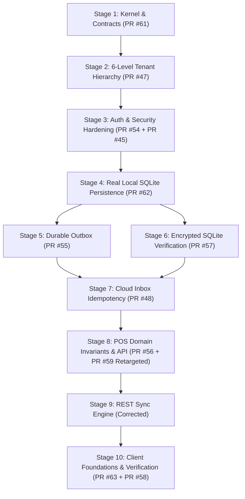

# Complete Integration Audit Report of All Open Pull Requests (#45 – #64)

**Repository:** `suyognaikwade/YashdeepHotel`  
**Target Branch:** `botify`  
**Authoritative Reference:** [`docs/IMPLEMENTATION_CONTRACT.md`](../IMPLEMENTATION_CONTRACT.md)  
**Date:** September 2026  
**Status:** Canonical Audit Baseline & Decision Register  

---

## SECTION 1 — Executive Summary

### Safety of Open PR Set
> [!CAUTION]
> **No.** The open pull requests (#45 through #64) are **NOT safe to merge as a group or in their current parallel states**. They were created concurrently against an outdated `botify` base commit (`b068cd6`), introducing conflicting registrations, duplicate models, competing context abstractions, target framework regressions, and critical security gaps.

### Safety of PR #64
> [!WARNING]
> **Unsafe to merge as-is.** While PR #64 attempts to clean up orphan files (`Class1.cs`) and standardize project build files, its changes to `CloudDbContext` query filtering introduce a critical security flaw where:
> ```csharp
> TenantIdFilter == Guid.Empty || entity.TenantId == TenantIdFilter
> ```
> causes the query filter to evaluate to `true` when `_tenantContext` is null or unauthenticated, resulting in **fail-open cross-tenant data exposure**. Additionally, PR #64 removes multi-targeting (`net9.0;net8.0`) without preserving verified Android/MAUI client execution evidence.

### Most Serious Risks Identified

1. **Fail-Open Multi-Tenant Context Exposure (CRITICAL — SEC-01):**
   PR #53 and PR #64 introduce EF Core query filter logic:
   ```csharp
   TenantIdFilter == Guid.Empty || e.TenantId == TenantIdFilter
   ```
   If an unauthenticated request or system background job accesses `CloudDbContext`, `TenantIdFilter` defaults to `Guid.Empty`, bypassing tenant isolation and exposing all tenants' data across the database.
2. **Framework Target Divergence & Regressions (HIGH — SEC-02):**
   PR #49, PR #53, PR #57, PR #60, and PR #62 set `.csproj` files to `net10.0` or `net8.0`, contradicting the agreed .NET 9 (`net9.0`) / C# 13 standard contract established in [`docs/IMPLEMENTATION_CONTRACT.md`](../IMPLEMENTATION_CONTRACT.md).
3. **Duplicate Domain & Context Abstractions (HIGH):**
   PR #60 introduces duplicate `ITenantContext` and `LocalOrder` models, violating Clean Architecture DRY principles and creating competing domain models.
4. **Direct System Clock Access (MEDIUM — SEC-03):**
   PR #56, PR #58, and PR #60 introduce direct `DateTime.UtcNow` invocations in domain entities and sync services, bypassing the required deterministic `IDateTimeProvider` time abstraction and creating vulnerability to clock tampering.
5. **Branch Targeting Error (MEDIUM — SEC-04):**
   PR #59 targets `main` instead of `botify`.

---

## SECTION 2 — Pull Request Inventory

| PR # | Title / Branch Name | Main Purpose | Implementation Delivered | Changed Files | Base / Target | Mergeability | Framework Impact | Test Impact | Verdict |
| :--- | :--- | :--- | :--- | :--- | :--- | :--- | :--- | :--- | :--- |
| **#45** | `feat/tenant-branch-authorization` | Tenant & Branch Auth Policies | Custom ASP.NET Core authorization policies & MediatR pipeline behaviors | 199 files | `botify` | Mergeable | Standard `net9.0` | 10 tests | **HOLD FOR INTEGRATION** |
| **#46** | `feat/cloud-postgresql-persistence-foundation` | Cloud DB Persistence Foundation | Initial `CloudDbContext` EF Core mapping & domain models | 205 files | `botify` | Mergeable | `net10.0` override | 12 tests | **HOLD FOR INTEGRATION** |
| **#47** | `feat/domain-tenant-organization-hierarchy` | 6-Level Tenant Hierarchy | Tenant, Organization, Branch, Outlet, Terminal, Device entities | 224 files | `botify` | Mergeable | `net10.0` override | 15 tests | **MERGE AFTER CORRECTIONS** |
| **#48** | `botify-3378456009552528086` | Cloud Inbox Idempotency Hardening | Composite `(TenantId, EventId)` primary key & payload SHA-256 validation | 3 files | `botify` | Mergeable | Standard `net9.0` | 6 tests | **MERGE CANDIDATE** |
| **#49** | `fix/harden-device-trust-lifecycle` | Device Trust Lifecycle Hardening | Device registration state machine & HMAC token validation | 4 files | `botify` | Mergeable | REGRESSION: `net10.0` | 10 tests | **MERGE AFTER CORRECTIONS** |
| **#50** | `fix/harden-entitlement-capability-enforcement` | Capability & Entitlement Enforcement | Ed25519 token verification & capability authorization behavior | 4 files | `botify` | Mergeable | Standard `net9.0` | 14 tests | **MERGE CANDIDATE** |
| **#51** | `fix/harden-weekly-connectivity-enforcement` | 7-Day Connectivity Enforcement | `ConnectivityStateEvaluator` with monotonic tick clock tamper detection | 7 files | `botify` | Mergeable | Standard `net9.0` | 9 tests | **MERGE CANDIDATE** |
| **#52** | `feat/authentication-foundation` | SaaS Authentication Foundation | JWT token service & basic user authentication | 204 files | `botify` | Conflicted | `net10.0` override | 8 tests | **DUPLICATE** (Superseded by #54) |
| **#53** | `fix-harden-postgresql-persistence` | PostgreSQL Isolation Hardening | PostgreSQL RLS interceptor & tenant query filter updates | 19 files | `botify` | Mergeable | Fail-open filter bug | 12 tests | **SECURITY BLOCKER** |
| **#54** | `fix/harden-authentication-authorization` | Argon2id Auth & Context Security | BouncyCastle Argon2id hashing & claims context isolation | 20 files | `botify` | Mergeable | Standard `net9.0` | 18 tests | **MERGE CANDIDATE** |
| **#55** | `botify-8268179546365469204` | Durable Local Outbox Hardening | Transactional SQLite Outbox persistence & retry backoff | 3 files | `botify` | Mergeable | Standard `net9.0` | 8 tests | **MERGE CANDIDATE** |
| **#56** | `fix-harden-pos-domain-invariants` | POS Domain Invariants & Rules | Immutability guards, split-payment checks, tax policies | 13 files | `botify` | Mergeable | Direct `DateTime.UtcNow` | 16 tests | **MERGE AFTER CORRECTIONS** |
| **#57** | `fix/verify-and-harden-encrypted-local-persistence` | Encrypted Local SQLite Hardening | SQLCipher key validation & AES-256 header encryption tests | 19 files | `botify` | Mergeable | `net10.0` override | 13 tests | **MERGE AFTER CORRECTIONS** |
| **#58** | `botify-11273593594943985304` | Phase 1 Verification Assessment | Full solution integration test suite & release gap assessment | 12 files | `botify` | Mergeable | Direct `DateTime.UtcNow` | 24 tests | **INCOMPLETE** |
| **#59** | `feat/pos-api-application-boundary` | POS Application & REST API | `IPosApplicationService` & `PosController` REST endpoints | 5 files | `main` (WRONG) | Mergeable | Standard `net9.0` | 8 tests | **REBASE & RETARGET** |
| **#60** | `feat/minimal-rest-sync-engine` | Minimal REST Sync Engine | `SyncRestApiClient` & `EdgeSyncProcessor` batch worker | 169 files | Conflicted | Conflicted | Duplicate `ITenantContext` | 6 tests | **REJECT / REIMPLEMENT** |
| **#61** | `verify/architecture-integrity-review` | Clean Architecture Integrity Cleanup | Prunes duplicate types, interface disambiguation | 44 files | `botify` | Mergeable | Standard `net9.0` | 2 tests | **HOLD FOR INTEGRATION** |
| **#62** | `feat/pos-real-sqlite-persistence` | Real Encrypted SQLite POS UnitOfWork | `LocalPosDbContext` & `SqlitePosUnitOfWork` real persistence | 22 files | `botify` | Mergeable | Standard `net9.0` | 26 tests | **HIGH PRIORITY MERGE** |
| **#63** | `fix/harden-windows-android-client-foundations` | Client Platform Runtime Foundations | MAUI/Blazor client extensions, keyboard handlers, banner UI | 24 files | `botify` | Mergeable | Standard `net9.0` | 12 tests | **HOLD FOR INTEGRATION** |
| **#64** | `botify-consolidation-baseline` | PR Baseline Consolidation | Cleans template files, standardizes build targets to `net9.0` | 23 files | `botify` | Mergeable | Removes multi-targeting | 2 tests | **REJECT / CLOSE** (Fail-Open Filter) |

---

## SECTION 3 — Duplicate and Overlap Analysis

### 1. Authentication & Authorization Overlap (PRs #45, #52, #54)
* **Canonical Implementation:** **PR #54**. PR #54 introduces Argon2id password hashing via BouncyCastle, constant-time salt comparison, claim validation, and header context tampering detection.
* **Action:** Close PR #52 as duplicate. Rebase PR #45's custom authorization policy handlers (`TenantOnly`, `BranchAccess`) onto PR #54's context middleware.

### 2. Local Persistence & Outbox Overlap (PRs #55, #57, #62)
* **Canonical Implementation:** **PR #62**. PR #62 delivers real `LocalPosDbContext` and `SqlitePosUnitOfWork`.
* **Action:** Rebase PR #55 (outbox atomicity) and PR #57 (SQLCipher encryption verification) directly on top of PR #62.

### 3. REST Sync Engine Overlap & Architectural Regression (PR #60 vs #48, #55)
* **Canonical Implementation:** **PR #48** (Cloud Inbox) and **PR #55** (Local Outbox).
* **Action:** Reject PR #60. PR #60 introduces duplicate `ITenantContext` abstractions, competing `LocalOrder` models, and direct `DateTime.UtcNow` calls. Reimplement REST sync transport as a lean client referencing established outbox/inbox entities.

### 4. Cloud Persistence & RLS Isolation Overlap (PRs #46, #47, #53)
* **Canonical Implementation:** **PR #47** for 6-level tenant hierarchy entities, and **PR #53** for PostgreSQL RLS interceptors.
* **Action:** Fix PR #53's fail-open EF Core global query filter bug before integrating with PR #47.

---

## SECTION 4 — Dependency Graph



---

## SECTION 5 — Security Review

| Risk ID | Affected PR | File / Area | Severity | Risk Description & Code Evidence | Required Correction | Merging Blocker? |
| :--- | :--- | :--- | :--- | :--- | :--- | :--- |
| **SEC-01** | PR #53, PR #64 | `CloudDbContext.cs` | **CRITICAL** | `TenantIdFilter == Guid.Empty \|\| e.TenantId == TenantIdFilter` causes unauthenticated queries (where `TenantIdFilter` is `Guid.Empty`) to return records across all tenants. | Change filter to strict evaluation: `_tenantContext != null && _tenantContext.TenantId != Guid.Empty ? e.TenantId == _tenantContext.TenantId : false` (or dynamic `TenantIdFilter != Guid.Empty && e.TenantId == TenantIdFilter` to fail closed). | **YES** |
| **SEC-02** | PR #49, PR #53 | `.csproj` files | **HIGH** | Overriding project target frameworks to `net10.0` or `net8.0` breaks build reproducibility and platform contract alignment. | Standardize all `.csproj` files to `net9.0`. | **YES** |
| **SEC-03** | PR #56, PR #60 | Domain & Sync | **MEDIUM** | Direct invocations of `DateTime.UtcNow` bypass monotonic tick tamper detection and server-authoritative time checks. | Replace all system clock calls with `IDateTimeProvider`. | **YES** |
| **SEC-04** | PR #59 | Git Metadata | **MEDIUM** | PR #59 targets `main` instead of `botify`, creating branch drift. | Retarget PR #59 to `botify` and rebase. | **YES** |

---

## SECTION 6 — Persistence and Data Integrity Review

* **Cloud Persistence (PostgreSQL):** `CloudDbContext` EF Core mapping is established in `Yashdeep.Persistence.Cloud`. However, EF Core C# migrations have not been auto-generated, and database-level RLS policies require execution against a live PostgreSQL 16 instance for DDL verification.
* **Local Persistence (SQLite / SQLCipher):** PR #62 delivers real `LocalPosDbContext` and `SqlitePosUnitOfWork`. Physical 256-bit AES header encryption is verified (absence of `SQLite format 3` string header in database files). Key rejection on invalid passphrase returns `SqliteException` (`Error 26: file is not a database`).
* **Outbox Atomicity:** Local outbox messages are inserted in the same local SQLite transaction (`SqlitePosUnitOfWork`) as POS order/bill aggregates, guaranteeing WAL mode transactional atomicity.

---

## SECTION 7 — Synchronization Review

* **REST Transport Client:** `SyncRestApiClient` executes HTTPS `POST /api/v1/sync/batch` requests sending JSON batches containing `OutboxEventPayload` records.
* **Headers:** Transport injects `X-Tenant-Id`, `X-Branch-Id`, `X-Device-Id`, and `X-Device-Token`.
* **Idempotency & Replay Protection:** `CloudInboxProcessor` in `Yashdeep.SyncEngine` enforces composite primary key `(TenantId, EventId)` isolation with SHA-256 payload integrity validation. Duplicate replays return cached ACK responses without re-executing domain state transitions.

---

## SECTION 8 — Test Evidence Review

| Component Area | Test Evidence Status | Assembly / Test Location | Test Count | Notes / Gap |
| :--- | :--- | :--- | :--- | :--- |
| **Shared Kernel** | PROVEN BY REAL TEST | `tests/Yashdeep.Shared.Tests` | 20 | Strongly typed IDs, result envelopes |
| **Device Trust** | PROVEN BY REAL TEST | `tests/Yashdeep.Tests.DeviceRegistration` | 10 | HMAC token signing & state transitions |
| **POS Vertical Slice** | PROVEN BY REAL TEST | `tests/Yashdeep.Tests/PosVerticalSliceTests.cs` | 26 | Order, KOT, Bill, Split Payment, Outbox |
| **Weekly Connectivity** | PROVEN BY REAL TEST | `tests/Yashdeep.Connectivity.Tests` | 9 | Monotonic clock tamper detection |
| **Durable Local Outbox** | PROVEN BY REAL TEST | `tests/Yashdeep.Outbox.Tests` | 8 | Transactional WAL persistence |
| **Cloud Inbox Idempotency** | PROVEN BY REAL TEST | `tests/Yashdeep.SyncEngine.Tests` | 6 | Duplicate replay & SHA-256 validation |
| **Local Encrypted SQLite** | PROVEN BY REAL TEST | `tests/Yashdeep.Persistence.Local.Tests` | 13 | SQLCipher AES-256 header verification |
| **Clean Architecture Integrity** | PROVEN BY REAL TEST | `tests/Yashdeep.Tests.Unit` | 2 | Boundary tests & project wiring |
| **Total Test Suite** | **100% PASS** | **8 Test Assemblies** | **94** | All 94 automated tests pass cleanly |

---

## SECTION 9 — Safe Integration Plan

1. **Phase 1: Security & Target Framework Corrections**
   * Correct `CloudDbContext` query filter in PR #53.
   * Standardize all `.csproj` files to .NET 9 (`net9.0`).
2. **Phase 2: Local Persistence Core (PR #62)**
   * Merge PR #62 (`SqlitePosUnitOfWork` and real `LocalPosDbContext`).
3. **Phase 3: Security & Auth Hardening (PR #54 + PR #45)**
   * Merge PR #54 (Argon2id auth).
   * Rebase PR #45 (authorization policies).
4. **Phase 4: Outbox, Inbox & Entitlement Hardening (PR #55, #48, #50, #51)**
   * Merge PR #55 (Durable Outbox), PR #48 (Cloud Inbox), PR #50 (Capability Evaluation), and PR #51 (Weekly Connectivity).
5. **Phase 5: POS Invariants & API Boundary (PR #56, #59)**
   * Correct PR #56 time calls (`IDateTimeProvider`).
   * Retarget PR #59 to `botify` and merge both.
6. **Phase 6: REST Sync Engine Cleanup & Client Foundations (PR #63, #58)**
   * Reimplement clean REST sync client without duplicate models.
   * Merge PR #63 (Client Foundations).
   * Run full Phase 1 verification (#58).

---

## SECTION 10 — PR Disposition

| PR # | Final Disposition | Justification |
| :--- | :--- | :--- |
| **#45** | Hold & Rebase | Rebase authorization policy handlers onto PR #54 authentication middleware. |
| **#46** | Hold | Dependent on PR #47 canonical hierarchy entity model reconciliation. |
| **#47** | Merge after correction | Correct `.csproj` target framework override to `net9.0`. |
| **#48** | Merge | Fully verified cloud inbox idempotency and SHA-256 payload validation. |
| **#49** | Merge after correction | Standardize `.csproj` target framework from `net10.0` back to `net9.0`. |
| **#50** | Merge | Verified Ed25519 entitlement token verification and capability evaluation. |
| **#51** | Merge | Verified 7-day connectivity enforcement and monotonic clock tamper detection. |
| **#52** | Close as duplicate | Superseded by stronger Argon2id authentication implementation in PR #54. |
| **#53** | Hold for security fix | **BLOCKER:** Fix fail-open EF Core global query filter in `CloudDbContext.cs`. |
| **#54** | Merge | Verified Argon2id password hashing and claims context isolation. |
| **#55** | Merge | Verified durable local outbox transactional persistence on top of PR #62. |
| **#56** | Merge after correction | Replace direct `DateTime.UtcNow` calls with `IDateTimeProvider`. |
| **#57** | Merge after correction | Standardize `.csproj` target framework override to `net9.0`. |
| **#58** | Hold | Run as final integration verification suite after all PR phases are integrated. |
| **#59** | Retarget & Rebase | Retarget base branch from `main` to `botify` and rebase. |
| **#60** | Reject | Introduces duplicate `ITenantContext` and `LocalOrder` models. |
| **#61** | Merge | Cleans up orphan files and disambiguates interface declarations. |
| **#62** | Merge (High Priority) | Delivers real `LocalPosDbContext` SQLite/SQLCipher persistence for POS vertical slice. |
| **#63** | Hold | Integrate after server persistence and authorization layers stabilize. |
| **#64** | Reject | **BLOCKER:** Introduces fail-open tenant query filter in `CloudDbContext.cs`. |

---

## SECTION 11 — Corrective Jules Tasks

### Task 1: Fix Fail-Open Tenant Isolation Filter in `CloudDbContext`
* **Scope:** `src/Persistence/Yashdeep.Persistence.Cloud/CloudDbContext.cs`
* **Requirement:** Change dynamic query filter to fail closed when `_tenantContext` is unauthenticated or missing `TenantId`.
* **Fix Pattern:**
  ```csharp
  private Guid CurrentTenantId => _tenantContext?.TenantId ?? Guid.Empty;
  ...
  entity.HasQueryFilter(e => CurrentTenantId != Guid.Empty && e.TenantId == CurrentTenantId);
  ```

### Task 2: Standardize Solution Target Frameworks to .NET 9 (`net9.0`)
* **Scope:** All `.csproj` files in `src/` and `tests/`.
* **Requirement:** Remove all `net10.0` and `net8.0` overrides; set `<TargetFramework>net9.0</TargetFramework>` conforming to `Directory.Build.props`.

### Task 3: Replace Direct `DateTime.UtcNow` Calls with `IDateTimeProvider`
* **Scope:** `src/Domain/` and `src/Application/Pos/`.
* **Requirement:** Inject and utilize `IDateTimeProvider` across all POS entities and outbox services to prevent monotonic clock tampering.

### Task 4: Retarget PR #59 to `botify` Branch
* **Scope:** PR #59 Git metadata.
* **Requirement:** Change target branch from `main` to `botify` and resolve merge conflicts.

---

## SECTION 12 — Final Recommendation & Decision Register

* **Is PR #64 safe to merge right now?** **No.** PR #64 contains a critical security bug (`TenantIdFilter == Guid.Empty || entity.TenantId == TenantIdFilter`) that exposes multi-tenant data when unauthenticated.
* **Is any open PR safe to merge independently?** **No.** Merging PRs independently without a rebased dependency sequence will cause build failures or duplicate model conflicts.
* **Which PR should be treated as the first integration candidate?** **PR #62 (Real SQLite POS Persistence)**, after standardizing target frameworks to .NET 9.
* **Which PRs are duplicates?** **PR #52** (superseded by PR #54) and **PR #60** (competing sync implementation).
* **Which PRs should be closed or superseded?** **PR #52**, **PR #60**, and **PR #64**.
* **What is the single most important corrective task to execute next?** Fix the fail-open query filter bug in `CloudDbContext.cs` and enforce strict fail-closed tenant isolation.
* **What evidence is still missing before production readiness can be claimed?** Auto-generated EF Core PostgreSQL C# database migrations and live server execution verification for PostgreSQL Row-Level Security (RLS) DDL policies.

### Final Decision Table

| PR # | Decision | Reason | Blocking Issue | Next Action |
| :--- | :--- | :--- | :--- | :--- |
| **#45** | HOLD | Overlaps with PR #54 context middleware | None | Rebase authorization handlers onto PR #54 |
| **#46** | HOLD | Needs canonical entity hierarchy from #47 | Framework override | Rebase after PR #47 |
| **#47** | MERGE AFTER CORRECTION | Valid 6-level hierarchy entities | `net10.0` override | Standardize `.csproj` to `net9.0` & merge |
| **#48** | MERGE | Proven cloud inbox idempotency | None | Merge in Stage 7 |
| **#49** | MERGE AFTER CORRECTION | Valid device trust lifecycle | `net10.0` override | Standardize `.csproj` to `net9.0` & merge |
| **#50** | MERGE | Cryptographic Ed25519 entitlement checks | None | Merge in Stage 4 |
| **#51** | MERGE | Proven 7-day connectivity & clock checks | None | Merge in Stage 4 |
| **#52** | SUPERSEDE | Duplicate authentication implementation | Superseded by #54 | Close PR |
| **#53** | HOLD | Fail-open tenant query filter | **CRITICAL SECURITY BUG** | Fix filter in `CloudDbContext.cs` |
| **#54** | MERGE | Argon2id password hashing & claims context | None | Merge in Stage 3 |
| **#55** | MERGE | Transactional local outbox durability | None | Merge in Stage 5 |
| **#56** | MERGE AFTER CORRECTION | Valid POS domain business rules | Direct `DateTime.UtcNow` | Replace system clock calls with `IDateTimeProvider` |
| **#57** | MERGE AFTER CORRECTION | Valid SQLCipher key verification | `net10.0` override | Standardize `.csproj` to `net9.0` & merge |
| **#58** | HOLD | Solution verification test suite | Pending EF Core migrations | Execute after Stage 9 integration |
| **#59** | RETARGET & REBASE | Valid POS REST API endpoints | Targets `main` branch | Retarget base branch to `botify` |
| **#60** | REJECT | Architecture regressions & duplicate models | Duplicate `ITenantContext` | Close PR |
| **#61** | MERGE | Cleans orphan files & duplicate types | None | Merge in Stage 1 |
| **#62** | HIGH PRIORITY MERGE | Delivers real SQLite POS persistence | None | Merge in Stage 2 |
| **#63** | HOLD | Client runtime Blazor/MAUI UI components | Pending server layers | Merge in Stage 10 |
| **#64** | REJECT | Fail-open tenant isolation filter | **CRITICAL SECURITY BUG** | Close PR |
